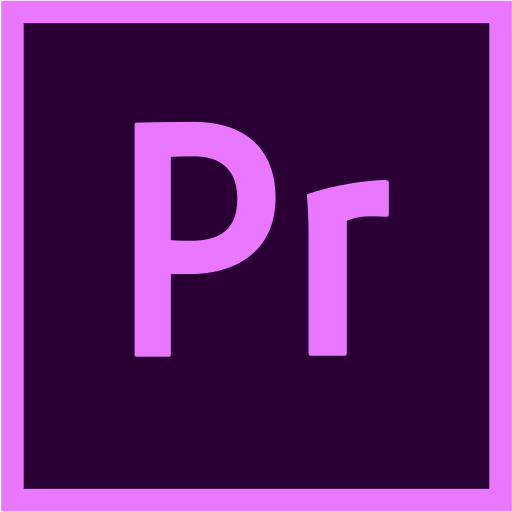

<!---
Rajsnehil/Rajsnehil is a ✨ special ✨ repository because its `README.md` (this file) appears on your GitHub profile.
You can click the Preview link to take a look at your changes.
--->

## :book: 𝙰𝚋𝚘𝚞𝚝 𝙼𝚎
- 🖥 𝙵𝚞𝚕𝚕-𝚜𝚝𝚊𝚌𝚔 𝚜𝚘𝚏𝚝𝚠𝚊𝚛𝚎 𝚍𝚎𝚟𝚎𝚕𝚘𝚙𝚎𝚛

**Database and analytics**

|  |  |  |  |  |  |  |
| --------------------------------------------------------------------- | ---------------------------------------------------------------------------------------- | ---------------------------------------------------------------------------------------- | --------------------------------------------------------------------------------- | ------------------------------------------------------------------------------ | ------------------------------------------------------------------------------------ | ------------------------------------------------------------------------------ |

**Utilities**

|  |  |  |  |  |  |  |
| ------------------------------------------------------------------------------------------- | ------------------------------------------------------------------------------------- | ---------------------------------------------------------------------------------------------- | --------------------------------------------------------------------------------------------------- | ------------------------------------------------------------------------------ | ---------------------------------------------------------------------------------------------------------------- | ---------------------------------------------------------------------------------------- |

**Library and frameworks**

|  |  |  |  |  |  |
| ------------------------------------------------------------------------------ | ----------------------------------------------------------------------- | ---------------------------------------------------------------------------------- | ------------------------------------------------------------------------------------- | ---------------------------------------------------------------------------------------------- | ---------------------------------------------------------------------------- |

**Design**

|  |  |  |
| ---------------------------------------------------------------------------------- | ---------------------------------------------------------------------------------------------- | ------------------------------------------------------------------------------------------------- |

 
