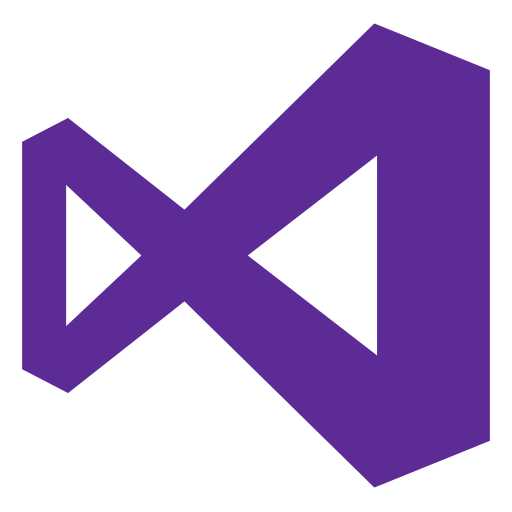

<!---
Rajsnehil/Rajsnehil is a ✨ special ✨ repository because its `README.md` (this file) appears on your GitHub profile.
You can click the Preview link to take a look at your changes.
--->

#  𝙰𝚋𝚘𝚞𝚝 𝙼𝚎 :book:

<h3>- 🖥 - I'm Snehil , Full Stack Software Developer [@ColoredCow](www.coloredcow.com).
</h3>

-----------------------------------------------------------------------------------------------------
<!-- Stand with Ukraine -->
<!--  -->

<!-- Greeting and tagline -->
<h1>Hi there </h1>

<!-- <h3 align="center">Hello, World!</h3>

 -->

<!-- hello world gif -->
<!-- 

   

 -->

 

<!-- introduction -->

<!-- coder gif -->
<!-- 

 -->

 

<!-- beautiful streak -->
<!-- 

 -->

 

 

<!-- activity graph -->

 

<!-- tech stacks -->

# Tech stacks 🚀

**Language and technologies**

|  |  |  |  |  |  |
| -------------------------------------------------------------------- | --------------------------------------------------------------------- | ------------------------------------------------------------------------ | --------------------------------------------------------------------------- | ------------------------------------------------------------------------ | --------------------------------------------------------------------- |

**Database and analytics**

|  |  |  |
| --------------------------------------------------------------------- | ---------------------------------------------------------------------------------------- | ---------------------------------------------------------------------------------------- |

**Utilities**

|  |  |  |  |  |  |
| ------------------------------------------------------------------------------------------- | ------------------------------------------------------------------------------------- | ---------------------------------------------------------------------------------------------- | ------------------------------------------------------------------------------ | ---------------------------------------------------------------------------------------------------------------- | ---------------------------------------------------------------------------------------- |

**Library and frameworks**

|  |  |  |  |
| ------------------------------------------------------------------------------ | ----------------------------------------------------------------------- | ---------------------------------------------------------------------------------- | ------------------------------------------------------------------------------------- |

<!-- **Design**

|  |  |  |
| ---------------------------------------------------------------------------------- | ---------------------------------------------------------------------------------------------- | ------------------------------------------------------------------------------------------------- |
 -->
 

<!-- classical stats -->

<!-- ### Classical stats ⚡

  -->

\*This README is night theme compatible
